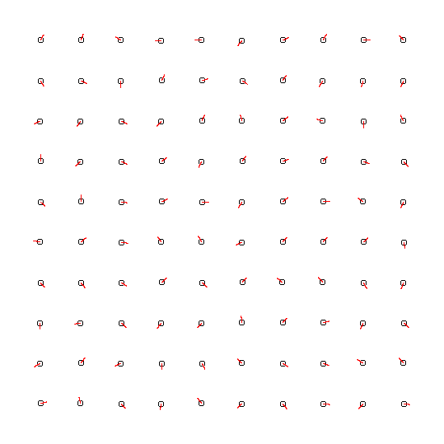

# go-boids
Golang implementation of Boid flocking

## Example

```bash
go run \
  github.com/downflux/go-boids/x/demo/generator --mode=grid | go run \
  github.com/downflux/go-boids/x/demo --frames=1500 --log_dir=demo/output/log/ > collision.gif
```



## Profiling

```bash
go test -v \
  github.com/downflux/go-boids/... \
  -benchmem \
  -cpuprofile cpu.out
  -memprofile mem.out

go tool pprof -tree -nodecount=10 cpu.out
```
